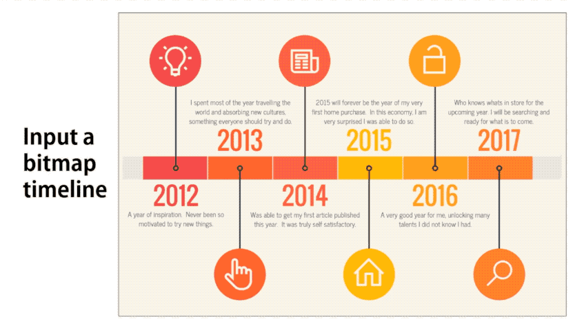

# Deep Learning-based Auto-Extraction of Extensible Timeline




## Introduction
This project, which is going to appear in IEEE VIS 2019, aims at extracting an extensible template from a bitmap timeline infogrpahic using a deep learning model. 
This project is builted based on [maskrcnn-benchmark](https://github.com/facebookresearch/maskrcnn-benchmark).
You can also check our [project webpage](https://chenzhutian.org/auto-infog-timeline/) from a deeper introduction.

In this repository, we release code and data for training the deep learning model
in our method.

## Citation
If you find our work useful in your research, please consider citing:
```
@ARTICLE{chen19, 
  author  = {Zhutian Chen and Yun Wang and Qianwen Wang and Yong Wang and Huamin Qu},
  title   = {{Towards Automated Infographic Design: Deep Learning-based Auto-Extraction of Extensible Timeline}},
  journal = {{IEEE Transactions on Visualization and Computer Graphics}},
  year    = {2018}, 
  volume  = {}, 
  number  = {}, 
  pages   = {1-1}
}
```

## Installation

Check [INSTALL.md](INSTALL.md) for installation instructions.

## Dataset
The real world timeline dataset we used can be downlowded [here](https://hkustconnect-my.sharepoint.com/:u:/g/personal/zchenbn_connect_ust_hk/ERa04v7ULwlJpvn_0YRRtHsBF7QFBp77t_7caxb8QR2QVg?e=ZKfomX).
The dataset contains images of timeline infographics with coco format annotations, 
divided into `train` and `val`:
```
timeline.zip
  |
  | - train
  |     | - coco_format.json // the annotations of the training images
  |     | - f002.jpg
  |     | - f002.T.jpg // the rotated f001.jpg
  |     | ...
  |
  | - val
  |    | - coco_format.json // the annotations of the testing images
  |    | - f001.jpg
  |    | ...
```
Create a folder `dataset/coco` in the root of this reprositary and 
then copy and unzip the dataset under the `dataset/coco` folder.
The details of path configurations can be found in `maskrcn_benchmark/config/paths_catalog.py`.

We also provide the single annotation for each image for those who want to re-split
the images into train and test. The annotations can be downloaded [here](https://hkustconnect-my.sharepoint.com/:u:/g/personal/zchenbn_connect_ust_hk/ESmSvxTW2cFJuV1vc5Z7H9UB9tgb1rQtttYYVSWj1b0kcg?e=MVFt3g).

## Training

### Multi-GPU training

Run the following command in the root of this repo:
```bash
export NGPUS=2
python -m torch.distributed.launch --nproc_per_node=$NGPUS /path_to_maskrcnn_benchmark/tools/train_net.py --config-file "path/to/config/file.yaml"
```

### Single GPU training

The defualt configuration files that we provide are used for running on 2 GPUs.
In order to run it on a single GPU, there are a few possibilities:

**1. Run the following without modifications**
```bash
python /path_to_maskrcnn_benchmark/tools/train_net.py --config-file "/path/to/config/file.yaml"
```
This should work out of the box and is very similar to what we should do for multi-GPU training.
But the drawback is that it will use much more GPU memory. The reason is that we set in the
configuration files a global batch size that is divided over the number of GPUs. So if we only
have a single GPU, this means that the batch size for that GPU will be 8x larger, which might lead
to out-of-memory errors.

If you have a lot of memory available, this is the easiest solution.

**2. Modify the cfg parameters**

If you experience out-of-memory errors, you can reduce the global batch size. But this means that
you'll also need to change the learning rate (to half), 
and the number of iterations (to double).

## Testing
After the training, the programm will conduct an evaluation and output the evaluation results. If you re-run the training without changing the `OUTPUT_DIR`,
the programm will load the last result in `OUTPUT_DIR` and directly run the evaluation code by skiping the training.

## Troubleshooting
If you have issues running or compiling this code, we have compiled a list of common issues in
[TROUBLESHOOTING.md](TROUBLESHOOTING.md). If your issue is not present there, please feel
free to open a new issue.

## Note
The code in this repo is under active development.

## License
Our code is released under MIT License (see LICENSE file for details).